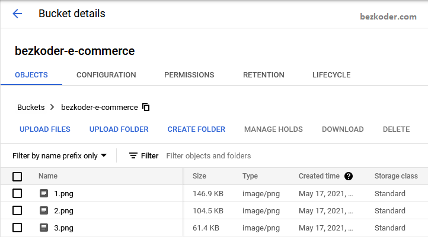

# CodeTech-Internship-Task-1

## 📷 Screenshots of Bucket Setup and File Uploads  

The following screenshots demonstrate the process of setting up a **Google Cloud Storage bucket**, uploading files, and configuring access permissions.  

---

### 🪣 Step 1: Bucket Creation  
  
This screenshot shows the creation of a new **Google Cloud Storage bucket**.  
- A unique bucket name was provided.  
- Location and storage class were selected.  
- Default access settings were applied.  

---

### 📂 Step 2: Uploading Files  
  
This image displays the **upload process** where multiple example files (`sample.txt`, `report.pdf`, `image.png`) were added to the bucket.  
- Files were successfully stored inside the created bucket.  

---

### 🔑 Step 3: Configuring Permissions  
  
This screenshot shows the **permissions tab** of the bucket.  
- Default access is **private**.  
- IAM roles were assigned to authorized users.  
- One file (`sample.txt`) was configured with **public access** to generate a shareable link.  

---

### ✅ Step 4: Verification  
  
The final screenshot demonstrates **verification of uploaded files**.  
- Public file accessed through the generated link.  
- Private files required authenticated login to view or download.  

---

These screenshots serve as proof of the **end-to-end process** of:  
1. Creating a bucket.  
2. Uploading example files.  
3. Configuring access permissions.  
4. Testing both private and public access.  
